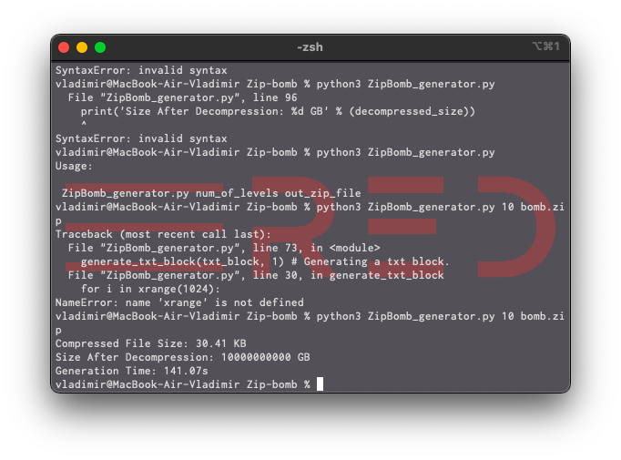

# 💥 Zip bomb (ضغط القنبلة) 

## What is it?

A _zip bomb_, also known as a _decompression bomb_  is a malicious archive file designed to crash or render useless the program or system reading it. It is often employed to disable _antivirus software_, in order to create an opening for more traditional _malware_.

A _zip bomb_ allows a program to function normally, but, instead of hijacking the program's operation, creates an archive that requires an excessive amount of time, disk space, or memory to unpack.

## Usage:
`python3 ZipBomb_generator.py num_of_levels out_zip_file`

## How to create one?

To build a _zip bomb_ you need to execute the python script:

`python3 ZipBomb_generator.py 10 bomb.zip` ('1' = 1.000.000 GB, i.e. '10' = 10.000.000 GB = 10.000 PB).

## Disclaimer

This zip file can hurt your system, you must understand all risks before doing anything. We don't want it to hurt anyone - it's here for analysis and tests which makes on prepared machines.

#
All material in this repository is in the public domain.
